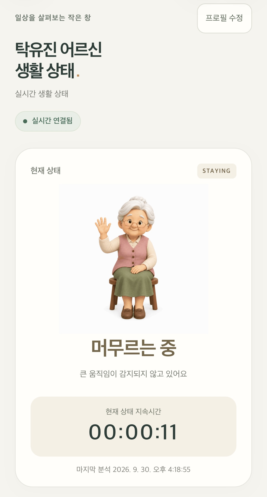
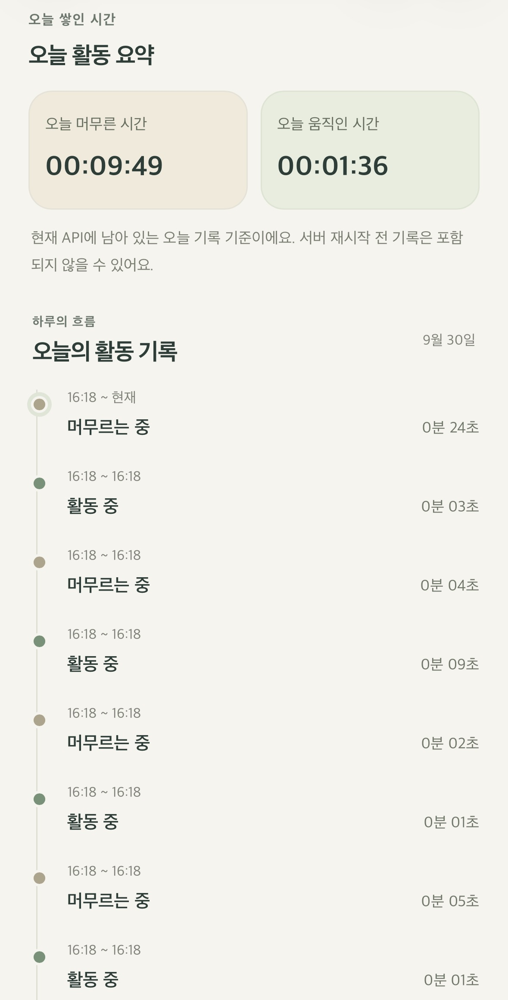
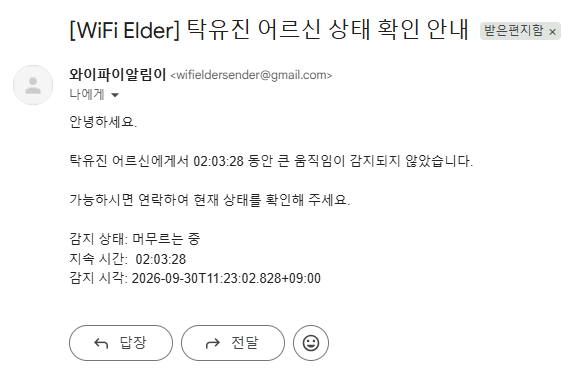

# Wi-Fi CSI 기반 독거 고령자 비접촉 생활 상태 모니터링 및 보호자 알림 시스템

**Wi-Fi CSI-Based Contactless Daily Activity Monitoring and Caregiver Alert System for Older Adults Living Alone**

카메라 영상이나 웨어러블 장치 없이 Wi-Fi CSI로 생활 상태를 구분하고, 보호자 웹과 지속시간 기반 이메일 알림으로 연결하는 연구 프로젝트입니다.

> Camera-free / Wearable-free Wi-Fi CSI Monitoring 
> **MOVING / STAYING** · ESP32 CSI → Python Random Forest → 보호자 웹 · 고정 실내 환경의 구현 가능성 확인

[시스템 구조](#시스템-구조) · [실제 실행 화면](#실제-실행-화면) · [실험 결과](#실험검증-결과) · [Quick Start](#quick-start--windows-powershell) · [연구 범위와 한계](#연구-범위와-한계)

## 왜 이 프로젝트를 만들었는가?

고령화와 1인 가구 증가에 따라, 혼자 생활하는 고령자의 생활 상태를 주변에서 바로 확인하기 어려운 상황이 발생할 수 있습니다. CCTV는 직접 확인할 수 있지만 생활공간을 지속적으로 촬영하며, 웨어러블 장치는 사용자가 직접 착용해야 합니다.

이 연구는 이러한 부담을 줄이기 위해 Wi-Fi 무선 신호의 변화를 활용합니다. 목표는 모델의 정확도만 높이는 것이 아니라, **실제 CSI 수집부터 상태 분류, 보호자 웹 확인, 이메일 알림까지 이어지는 서비스의 구현 가능성**을 확인하는 것입니다.

**판단 대상은 MOVING/STAYING 상태와 지속시간입니다.** 건강 진단, 응급상황 판별, 낙상 감지 또는 고독사 예방 효과를 검증한 시스템은 아닙니다.

## 핵심 기능

| 기능 | 현재 구현 |
|---|---|
| 비접촉 센싱 | ESP32의 실제 CSI를 수집하고 306개 subcarrier amplitude 전달 |
| 생활 상태 판정 | Random Forest의 MOVING 확률에 0.70 임계값 적용 |
| 보호자 웹 | 현재 상태·지속시간·오늘 누적 활동 시간·최근 활동 기록 |
| 프로필 | 이름·성별·보호자 이메일 설정 및 수정 |
| 연결 상태 | CSI와 정상 추론의 freshness를 기준으로 LIVE/재연결 상태 표시 |
| 모바일 접속 | 같은 LAN의 PC·휴대폰 브라우저에서 보호자 웹 접근 |
| 선택적 이메일 | 지속시간 기반 알림과 interval·stage별 중복 전송 시도 방지 |

## 시스템 구조

~~~text
ESP32
  │ 실제 Wi-Fi CSI · 306 subcarriers
  ▼ UDP :5005
RuView 기반 Rust sensing-server
  │ 유효 ADR-018 CSI frame
  ▼ WebSocket :3001 /ws/activity/csi
Python activity_app_server.py
  │ frame-mean normalization → 3.0초 window / 1.5초 hop → 918 features
  ▼
Random Forest (LYING / MOVING / SITTING)
  │ P(MOVING) >= 0.70 → MOVING, 그 미만 → STAYING
  ▼
상태·지속시간·history 관리
  ├─ HTTP API :8010 → React + TypeScript 보호자 웹 :8090
  └─ 지속시간 조건 → Python SMTP worker → 보호자 이메일
~~~

**이 연구에서 RuView의 역할은 CSI 수신·전달 인프라입니다.** ESP32 데이터를 UDP로 받고, 유효한 306-subcarrier CSI를 연구용 WebSocket으로 Python에 전달합니다. 생활 상태 판정·프로필·보호자 웹·이메일 연동은 이 위에 구현한 연구 서비스입니다.

이메일은 **Python backend가 발송**합니다. 웹 polling이나 브라우저 타이머가 발송을 결정하지 않으므로, 브라우저를 닫아도 backend가 실행 중이면 알림 조건 검사가 계속됩니다.

### CSI 전처리와 특징 추출

프레임 개수 대신 **timestamp 기준**으로 window를 구성합니다. 각 frame의 amplitude를 해당 frame의 평균으로 정규화한 뒤, subcarrier별로 아래 특징을 같은 순서로 연결합니다.

| 처리/특징 | 설정 |
|---|---|
| 입력 | 프레임당 306개 유한한 숫자 amplitude |
| Frame normalization | amplitude / frame amplitude mean |
| 0 나눗셈 안전 처리 | abs(frame mean) <= 1e-12인 frame은 0 벡터 |
| Window / hop | 3.0초 / 1.5초 |
| Temporal mean | 306차원 |
| Population standard deviation | 306차원, ddof=0 |
| Mean absolute temporal difference | 시간순 연속 frame 간 평균 절대 변화량, 306차원 |
| 최종 입력 | 위 세 특징을 순서대로 연결한 918차원 |

persons, keypoints, person count 및 RuView motion level은 모델 입력이나 정답 label로 사용하지 않습니다.

### 모델 클래스와 서비스 상태의 차이

현재 모델은 `v2/data/models/activity/activity_heightLayoutB_v2.joblib`의 **3-class Random Forest**이며, 로드한 모델의 클래스 순서는 `LYING, MOVING, SITTING`입니다.

~~~text
P(MOVING) >= 0.70  → MOVING  (활동 중)
P(MOVING) <  0.70  → STAYING (머무르는 중)
~~~

backend는 `model.classes_`에 대응하는 `predict_proba` 값에서 MOVING 확률을 찾습니다. **2-class Random Forest를 새로 학습한 구조가 아닙니다.** SITTING과 LYING은 최종 서비스 관점에서 STAYING으로 통합하며, STAYING은 특정 자세나 건강 상태를 확정하는 값이 아닙니다.

## 실제 실행 화면

아래는 사용자가 제공한 실제 실행 캡처입니다. 새로 생성한 결과 이미지가 아니며, 각 화면은 동일 시점의 연속 캡처를 의미하지 않습니다.

<table>
  <thead>
    <tr>
      <th>현재 상태와 지속시간</th>
      <th>오늘 활동 시간과 기록</th>
    </tr>
  </thead>
  <tbody>
    <tr>
      <td valign="top"></td>
      <td valign="top"></td>
    </tr>
  </tbody>
</table>

**현재 상태 화면:** 실제 ESP32 CSI를 사용한 실행에서 STAYING과 상태 지속시간이 보호자 웹에 표시된 모습입니다. 
**활동 정보 화면:** MOVING/STAYING의 당일 누적 시간과 각 상태 구간의 지속시간을 확인할 수 있습니다. 누적 시간은 backend에 남아 있는 당일 기록 기준입니다.

### 지속시간 기반 이메일 수신

STAYING 상태와 **02:03:28**의 지속시간이 포함된 실제 Gmail 수신 캡처입니다. 이는 **과거 실행의 알림 연동 예시**이며, 현재 소스의 STAYING 기본값인 3시간을 검증한 캡처는 아닙니다. 당시 적용한 임계값을 이 이미지로 추정하지 않습니다.

## 실험·검증 결과

현재 연구는 **고정된 실내 환경에서의 기능 연동 확인**과 분류 성능 평가를 구분합니다.

| 항목 | 확인 수준 |
|---|---|
| 실제 ESP32 CSI 수신, 306 subcarriers, 증가하는 sequence | 사용자 실기 확인 보고 |
| Rust → 연구 WS → Python 연결 및 Random Forest 추론 | 사용자 실기 확인 보고, 구현 경로 확인 |
| 0.70 임계값에 따른 MOVING/STAYING 출력 | 구현 및 경계값 단위 테스트 |
| 보호자 웹 상태·지속시간·활동 시간·기록 표시 | 제공된 실행 화면 및 사용자 확인 |
| STAYING 지속시간 기반 Gmail 수신 | 제공된 실제 수신 캡처 |
| 동일 interval·stage의 중복 전송 시도 방지 | 사용자 확인 보고 및 SMTP mock 단위 테스트 |
| MOVING 이메일 실제 수신 | 현재 제공된 실기 증거로는 미확인 |
| 최종 MOVING/STAYING Accuracy / Macro F1 | 별도 정답 데이터와 비교하는 추가 평가 필요 |

기존 3-class baseline/CV 결과는 **현재 2-state 서비스 정확도가 아닙니다.** 현재 모델 metadata에 기록된 과거 모델 선택 지표도 최종 MOVING/STAYING 성능으로 전용하지 않습니다. 이 README에는 확인되지 않은 정확도·F1 수치를 제시하지 않습니다.

자동 테스트의 CSI·확률·SMTP는 fixture/mock입니다. 테스트나 빌드 성공을 실제 센서 성능·Gmail 배달 보장으로 해석하지 않습니다. 이전 코드 보존 검증의 범위와 결과는 [안전한 정리 기록](docs/RESEARCH_CLEANUP_AUDIT.md)에 있습니다.

## Quick Start — Windows PowerShell

> **Clone만으로 실행 준비가 끝나지 않습니다.** CSI firmware가 준비된 ESP32와 **별도 모델 파일**이 필요합니다. Gmail App Password는 이메일을 사용할 때만 필요합니다.

### 준비물

| 준비물 | 확인할 내용 |
|---|---|
| ESP32 CSI node | 저장소 firmware는 ESP32-S3를 기본 지원하며 C6는 별도 연구 대상. 실제 보드에 맞는 firmware 필요 |
| Wi-Fi/LAN | ESP32와 PC가 UDP로 통신 가능해야 하며, 휴대폰도 PC API에 접근 가능한 같은 LAN 사용 |
| Rust | `v2/rust-toolchain.toml`의 1.89 toolchain 및 Windows MSVC 빌드 도구 |
| Python | 모델과 호환되는 환경. 로컬 read-only 모델 로드 확인은 Python 3.12에서 수행 |
| Python 패키지 | requirements에 고정된 numpy/scikit-learn 및 joblib, websocket-client |
| Node.js / npm | `ui/senior-monitor/package.json` 기준 Node.js 24 이상 |
| 모델 | 아래 Model Preparation의 정확한 위치에 별도 준비 |
| 이메일 사용 시 | 본인 Gmail의 App Password와 수신 가능한 보호자 이메일 |

새 ESP32의 firmware 설정·빌드·provisioning은 [firmware 안내](firmware/esp32-csi-node/README.md)를 참고하세요. 보드 종류·COM 포트·flash 크기를 먼저 확인하고, Wi-Fi credential을 소스나 공개 문서에 넣지 마세요. **이미 정상 수신 중인 보드는 이 README를 적용하기 위해 다시 flash할 필요가 없습니다.**

### 0. Clone 및 의존성 준비

새 개발 환경에서 실행합니다. 이미 사용 중인 운영 Python 환경은 덮어쓰지 않습니다.

~~~powershell
git clone --recurse-submodules https://github.com/ttyujin/WIFI_CSI.git
cd WIFI_CSI
git submodule update --init --recursive

python -m venv .venv
& .\.venv\Scripts\python.exe -m pip install -r .\v2\tools\activity_baseline_requirements.txt joblib websocket-client

Push-Location .\ui\senior-monitor
npm ci
Pop-Location
~~~

`python` 명령이 없는 Windows에서는 설치된 Python 3.12 launcher로 `py -3.12 -m venv .venv`를 사용할 수 있습니다. 아래 예시는 activation/ExecutionPolicy 변경 없이 `.venv`의 Python을 직접 실행합니다.

### Model Preparation

**현재 모델은 Git 추적 대상이 아니며 clone에 포함되지 않습니다.** 로컬 Git index와 `.gitignore`의 `models/` 규칙을 확인했습니다. 이 checkout에는 해당 모델의 별도 Release/LFS 배포 안내가 없어 임의 다운로드 링크를 제공하지 않습니다.

기존 연구 모델을 별도로 확보해 다음 위치에 준비하세요.

~~~text
WIFI_CSI/
└─ v2/data/models/activity/activity_heightLayoutB_v2.joblib
~~~

저장소 루트에서 확인:

~~~powershell
Test-Path .\v2\data\models\activity\activity_heightLayoutB_v2.joblib
~~~

`True`여야 합니다. 기존 `models/activity_v1/model.joblib`은 별도의 offline artifact이며, 현재 서비스 모델 대신 임의로 사용하면 안 됩니다. joblib 파일은 실행 가능한 객체를 포함할 수 있으므로 신뢰할 수 있는 출처의 모델만 로드하세요.

### 1. PC IP 확인

~~~powershell
ipconfig
~~~

실제 Wi-Fi/Ethernet 어댑터의 IPv4 주소를 확인합니다. 연구 PC에서는 **192.168.0.60**을 사용했지만 **다른 PC의 고정 주소가 아닙니다.**

ESP32의 CSI 전송 대상은 자신의 PC IPv4와 UDP **5005**로 설정해야 합니다. UDP 허용 목록에는 **보내는 ESP32의 IP 또는 신뢰된 네트워크의 CIDR**을 지정합니다. PC IP를 확인하지 않고 기존 주소를 그대로 복사하지 마세요.

### 2. Rust sensing-server — 터미널 1

아래 각 터미널은 **저장소 루트에서 시작**합니다. 새 clone에 실행 파일이 없다면 먼저 빌드합니다.

~~~powershell
cd v2
cargo build --locked -p wifi-densepose-sensing-server --bin sensing-server --release --target-dir target/activity-live-v2-build
~~~

이미 정상 운영 중인 바이너리가 있으면 다시 빌드하거나 교체할 필요가 없습니다. 새 빌드의 출력 위치도 **v2/target/activity-live-v2-build/release/sensing-server.exe**입니다.

같은 터미널의 v2에서 실행:

~~~powershell
$csiPcIp = Read-Host 'ipconfig에서 확인한 PC IPv4 주소'
$csiAllowedSources = Read-Host 'ESP32 IPv4 또는 신뢰된 LAN CIDR'

.\target\activity-live-v2-build\release\sensing-server.exe `
  --source esp32 `
  --udp-port 5005 `
  --udp-bind $csiPcIp `
  --udp-allow $csiAllowedSources `
  --http-port 3000 `
  --ws-port 3001 `
  --ui-path ..\ui
~~~

연구 PC의 입력 예는 PC **192.168.0.60**, 허용 대역 **192.168.0.0/24**입니다. 자신의 환경에서는 실제 주소·대역으로 바꾸세요. UDP는 인증된 전송이 아니므로 불필요하게 허용 범위를 넓히지 않습니다.

| 용도 | 실행 주소 |
|---|---|
| CSI 수신 | 자신의 PC IPv4, UDP 5005 |
| Rust HTTP | http://localhost:3000 |
| 연구 CSI WebSocket | ws://localhost:3001/ws/activity/csi |
| 원본 정적 UI 경로 | --ui-path ..\ui; 보호자 웹은 별도 Vite 프로세스 |

Rust CLI 자체의 기본 HTTP/WS 포트는 연구 설정과 다르므로 **3000/3001 옵션을 생략하지 마세요.**

### 3. CSI 확인 — 별도 확인 터미널

~~~powershell
1..10 | ForEach-Object {
    $j = Invoke-RestMethod http://localhost:3000/api/v1/sensing/latest
    $n = $j.nodes[0]

    [PSCustomObject]@{
        Seq = $n.sync.sequence
        Subcarriers = $n.subcarrier_count
        RSSI = $n.rssi_dbm
    }

    Start-Sleep -Milliseconds 500
}
~~~

정상 데이터에서는 sequence가 계속 증가하고 **Subcarriers = 306**이 관찰됩니다. 여러 node가 있다면 검사 대상 node를 선택하세요. **sequence 증가만으로 충분하지 않습니다.** 0-subcarrier/status 메시지로 API가 살아 있어도 연구 WS·모델 입력에 사용할 유효 CSI가 들어온 것은 아닐 수 있습니다.

### 4. Python backend — 터미널 2

저장소 루트에서:

~~~powershell
cd v2
& ..\.venv\Scripts\python.exe tools/activity_app_server.py
~~~

정상 시작 로그의 핵심 항목:

~~~text
Activity API: http://localhost:8010
Model loaded: ...activity_heightLayoutB_v2.joblib
Classes: ['LYING' 'MOVING' 'SITTING'] Features: 918
Rule: MOVING if P(MOVING) >= 0.70
CSI socket connected; waiting for a new valid window
~~~

메일 credential이 없으면 알림 비활성화 warning이 나올 수 있으나, CSI 추론·API는 계속 실행됩니다. **소켓 연결 성공만으로 LIVE가 되지 않습니다.** 유효한 306 CSI로 새 3초 window를 구성하고 정상 prediction이 완료되어야 합니다.

### 5. Backend 상태 확인

~~~powershell
Invoke-RestMethod http://localhost:8010/api/activity/current |
    ConvertTo-Json -Depth 5
~~~

| 필드 | 의미 |
|---|---|
| `state` | LIVE에서 MOVING 또는 STAYING. 데이터 대기/단절 시 UNKNOWN |
| `connection_status` | CONNECTING / LIVE / RECONNECTING |
| `is_live` | 현재 유효 CSI와 정상 추론을 기준으로 연결됐는지 |
| `moving_probability` | 모델의 실제 MOVING 확률 |
| `duration_seconds` | 현재 상태의 표시 지속시간 |
| `confirmed_duration_seconds` | 마지막 성공 prediction까지 확인한 지속시간 |

HTTP 응답이 200이어도 **is_live=false**일 수 있습니다. CSI나 정상 prediction이 5초 이상 없으면 재연결 상태가 되고, 단절 시간과 복구 후 새 window 준비시간은 활동 시간에 포함하지 않습니다.

### 6. 보호자 웹 — 터미널 3

저장소 루트에서:

~~~powershell
cd ui/senior-monitor
npm start
~~~

준비 단계의 `npm ci`를 생략했다면 먼저 실행하세요. 현재 package scripts에는 `dev`가 없으므로 **`npm run dev` 대신 `npm start`**를 사용합니다.

- PC: `http://localhost:8090`
- 같은 LAN의 휴대폰: `http://<YOUR_PC_IP>:8090`
- 연구 PC의 예: `http://192.168.0.60:8090`

Vite는 `0.0.0.0:8090`에 bind하며, 8090이 사용 중이면 다른 포트로 자동 이동하지 않습니다. 웹은 `http://${window.location.hostname}:8010`으로 backend를 찾으므로 모바일 API 주소를 localhost로 고정하지 않습니다.

최초 접속에서 이름 → 성별 → 보호자 이메일을 설정합니다. 프로필은 backend의 **v2/data/senior-monitor/profile.json**에 저장되며, **history와 알림 중복 방지 이력은 메모리 기반**입니다. Python 재시작 이전의 활동 기록은 오늘 누적 시간에 포함되지 않을 수 있습니다.

### 7. 이메일 — 선택 기능

메일을 사용할 경우 터미널 2의 backend를 Ctrl+C로 종료한 뒤, **같은 PowerShell 창의 v2 위치에서** 아래처럼 설정하고 재시작합니다. 일반 Gmail 로그인 비밀번호가 아니라 본인 계정의 App Password를 사용하세요.

~~~powershell
$env:WIFI_ELDER_SENDER_EMAIL = Read-Host '발신 Gmail 주소'
$mailSecret = Read-Host 'Gmail App Password' -AsSecureString
$env:WIFI_ELDER_SENDER_APP_PASSWORD = ([System.Net.NetworkCredential]::new('', $mailSecret)).Password.Replace(' ', '')
Remove-Variable mailSecret

try {
    & ..\.venv\Scripts\python.exe tools/activity_app_server.py
}
finally {
    Remove-Item Env:WIFI_ELDER_SENDER_APP_PASSWORD -ErrorAction SilentlyContinue
}
~~~

입력 내용을 README·소스·JSON·스크린샷·로그에 남기지 마세요. secure prompt는 화면/명령 기록 노출을 줄이지만 실행 중 환경변수·프로세스 메모리에는 평문이 존재합니다.

현재 `senior_monitor_alerts.py`의 환경변수와 기본값:

| 환경변수 | 소스 기본값 / 역할 |
|---|---|
| `WIFI_ELDER_SENDER_EMAIL` | 기본 발신 주소 `wifieldersender@gmail.com`; 실제 사용 시 본인 발신 계정 지정 |
| `WIFI_ELDER_SENDER_APP_PASSWORD` | 기본값 없음. 해당 발신 계정의 App Password |
| `WIFI_ELDER_STAYING_NOTICE_SECONDS` | 10800초, 3시간 |
| `WIFI_ELDER_MOVING_NOTICE_SECONDS` | 3600초, 1시간 |
| `WIFI_ELDER_CAUTION_SECONDS` | 14400초, 4시간 |
| `WIFI_ELDER_DANGER_SECONDS` | 21600초, 6시간 |

기존 `WIFI_ELDER_STAYING_ALERT_SECONDS` / `WIFI_ELDER_MOVING_ALERT_SECONDS`는 새 NOTICE 변수가 없을 때만 읽는 호환용 이름입니다. 환경변수는 backend 시작 시 읽으므로 변경 후 재시작해야 합니다. 각 상태의 NOTICE < CAUTION < DANGER이고, 값은 유한한 양수여야 합니다.

> 이 임계값은 **지속시간 기반 서비스 heuristic**이며 임상적 기준이 아닙니다. 코드의 CAUTION/DANGER 이름도 건강 이상이나 응급 여부를 판단했다는 뜻이 아닙니다.

유효 프로필과 credential이 있어야 이메일을 활성화합니다. 같은 interval의 같은 stage는 최대 한 번 전송을 시도하고, 상태 전환·단절 후 복구 시 새 interval로 구분합니다. SMTP 실패는 자동 재전송하지 않으며 **배달 성공이나 exactly-once 수신을 보장하지 않습니다.**

GET /api/profile의 **email_alerts_enabled=true**는 설정상 활성화됐다는 뜻이지 Gmail 인증/수신 확인 결과가 아닙니다. 실제 수신은 본인 테스트 주소로 확인하세요. 단계별 수동 검증과 App Password 안내는 [EMAIL_ALERTS.md](ui/senior-monitor/EMAIL_ALERTS.md)에 있습니다.

## Troubleshooting

| 증상 | 먼저 확인할 사항 |
|---|---|
| CSI가 들어오지 않음 | PC IP, ESP32 전송 대상, UDP 5005, ESP32 source IP 허용 목록, 방화벽 |
| sequence는 증가하지만 subcarriers가 0 | status/vitals freshness와 유효 CSI를 구분. 유효 306 amplitude가 들어오는지 확인 |
| Python이 계속 CONNECTING/RECONNECTING | WS 3001/ws/activity/csi, 유효 306 CSI, 새 3초 window, 정상 prediction 확인 |
| WebSocket 연결 timeout | 현재 구현은 초기 연결 5초, 연결 후 receive timeout 1초. receive wakeup은 별도 freshness 기준이 아님 |
| 모델 파일 오류 | 정확한 경로, 신뢰된 모델, numpy/scikit-learn 호환 버전 확인. 이전 artifact로 임의 교체하지 않음 |
| 8090 또는 8010 사용 중 | 해당 포트의 기존 프로세스를 확인. 중복 backend는 사용하지 않음 |
| PC에서는 되지만 휴대폰에서는 안 됨 | 휴대폰에서 PC의 LAN IP 사용, 같은 LAN/접근 가능 여부, Windows 방화벽 TCP 8090·8010 확인 |
| 이메일이 비활성화되거나 오지 않음 | 프로필·본인 발신 계정·App Password·유효 임계값·연속 LIVE duration·스팸함 확인 |
| 재시작 후 오늘 활동 기록이 줄어듦 | history는 메모리 기반. 과거 기록을 영구 복구하는 기능은 현재 없음 |

인증된 다중 사용자 서비스가 아니므로 **신뢰된 LAN에서만 사용하고 공개 인터넷으로 port-forward하지 마세요.** CSI 단절을 STAYING으로 해석하거나 빈 데이터로 알림을 발송하지 않습니다.

## 프로젝트 구조

~~~text
WIFI_CSI/
├─ firmware/esp32-csi-node/               # CSI 수집 및 UDP 전송 firmware
├─ v2/
│  ├─ crates/wifi-densepose-sensing-server/
│  │  └─ src/
│  │     ├─ main.rs                      # UDP, HTTP, 연구 CSI WebSocket
│  │     └─ activity_recording.rs         # 유효 CSI 계약 및 연구 recording
│  ├─ tools/
│  │  ├─ activity_app_server.py           # 현재 서비스 추론·상태·HTTP API
│  │  ├─ senior_monitor_alerts.py         # 프로필·SMTP·중복 방지
│  │  ├─ validate_heightLayoutA_cv.py     # 현재 특징 추출의 간접 의존성
│  │  ├─ train_activity_baseline.py       # 정규화·918 특징 추출 함수
│  │  ├─ prepare_activity_dataset.py     # 데이터/window 처리 의존성
│  │  ├─ train_heightLayoutB_v2.py        # 현재 RF 모델의 연구 학습 도구
│  │  └─ ...                             # 수집·QC·audit·평가·이전 artifact 도구
│  └─ data/
│     ├─ models/activity/                 # 별도 준비 모델; Git 제외
│     ├─ recordings/activity/             # 로컬 실측 JSONL; Git 제외
│     ├─ processed/                       # 로컬 연구 산출물; Git 제외
│     └─ senior-monitor/                  # 로컬 개인 프로필; Git 제외
├─ ui/senior-monitor/                    # React + TypeScript + Vite 보호자 웹
├─ docs/
│  ├─ images/activity/                    # 제공된 실제 실행 캡처
│  ├─ RESEARCH_SERVICE.md                 # 실행 경로·간접 의존성 상세
│  └─ RESEARCH_CLEANUP_AUDIT.md            # 보존 판단·검증 기록
├─ LICENSE
└─ README.md
~~~

수집/QC/학습/평가 도구는 연구 재현용이며 Quick Start에서 실행할 필요가 없습니다. 특히 **train_heightLayoutB_v2.py는 실행하면 모델을 저장**하므로 서비스 실행을 위해 다시 학습하지 마세요. 이전 offline activity_inference.py도 현재 backend의 진입점이 아닙니다.

원본 RuView의 다른 crate/UI/도구는 같은 바이너리의 빌드·테스트·간접 의존성 때문에 남아 있습니다. 해당 코드가 있다는 사실이 그 기능을 이 연구에서 사용하거나 검증했다는 뜻은 아닙니다.

## 사용 기술

| 계층 | 기술 |
|---|---|
| Hardware / sensing | ESP32 CSI node, ESP-IDF, Wi-Fi CSI |
| Transport | RuView 기반 Rust 서버, UDP, WebSocket |
| Backend / ML | Python, NumPy, scikit-learn Random Forest, joblib, websocket-client |
| Frontend | React, TypeScript, Vite |
| Notification | Python SMTP_SSL, Gmail App Password, 프로세스 환경변수 |
| 검증 | Python unittest, Vitest / Testing Library, Cargo tests, PowerShell helper tests |

## 검증 명령

아래는 자동 회귀 검사입니다. 실제 ESP32나 보호자 메일을 사용하는 검증과 구분하세요.

**저장소 루트 — backend / profile / SMTP mock tests**

~~~powershell
& .\.venv\Scripts\python.exe -m unittest discover -s v2/tools -p 'test_*.py' -v
~~~

**v2 — 연구 도구 tests**

~~~powershell
& ..\.venv\Scripts\python.exe -m unittest discover -s tools/tests -p 'test_*.py' -v
.\tools\tests\test_collect_activity.ps1
~~~

**ui/senior-monitor — 보호자 웹**

~~~powershell
npm test
npm run build
~~~

**v2 — 기존 운영 바이너리를 덮어쓰지 않는 Rust 검사**

~~~powershell
cargo check --locked -p wifi-densepose-sensing-server --bin sensing-server --target-dir target/activity-cleanup-check
cargo test --locked -p wifi-densepose-sensing-server --target-dir target/activity-cleanup-check
~~~

각 블록은 표시한 디렉터리에서 별도로 실행합니다. 자세한 수동 확인 절차는 [보호자 웹 README](ui/senior-monitor/README.md), 구현 의존성 설명은 [RESEARCH_SERVICE.md](docs/RESEARCH_SERVICE.md)를 참고하세요.

## 연구 범위와 한계

- 고정된 실내 환경에서 수집·구현한 연구이며, 다른 공간·배치·RSSI 조건에서 같은 성능을 보장하지 않습니다.
- 독거 고령자를 위한 사용 목적과 **실제 고령자 집단의 임상적 검증**은 다릅니다. 건강 진단·응급 판별·낙상 감지 시스템이 아닙니다.
- 최종 서비스는 MOVING/STAYING 중심이며, 정확한 앉기/눕기 자세나 부재 여부를 판단하지 않습니다.
- 최종 2-state Accuracy/Macro F1, 다른 참여자·환경에서의 성능은 추가 평가가 필요합니다. 평가 시 겹치는 window를 frame 단위로 random split하지 않고 session을 분리해야 합니다.
- history와 알림 이력은 메모리 기반이며 재시작 후 복구되지 않습니다. 메일 전달 지연·스팸 처리·Gmail 제한도 영향을 줄 수 있습니다.
- 카메라 영상 노출을 줄이는 방식이지 개인정보 문제가 없어지는 것은 아닙니다. CSI recording·프로필·이메일 정보·credential을 공개 저장소에 포함하지 마세요.
- 모델·로컬 데이터·빌드된 실행 파일은 clone만으로 준비되지 않습니다. 신뢰된 LAN의 단일 PC·단일 프로필 연구 서비스입니다.

## Based on RuView / Acknowledgement

이 프로젝트는 [ruvnet/RuView](https://github.com/ruvnet/RuView)의 ESP32 CSI 수집 및 Rust 수신 인프라를 기반으로, 연구용 유효 CSI 전달과 Python·Random Forest·보호자 웹·이메일 서비스를 구성한 수정·확장 프로젝트입니다. 원본 프로젝트의 기여자들에게 감사드립니다.

원본의 DensePose/pose estimation, vital signs, fall detection, multi-person, 스마트홈·3D 시각화 등의 기능과 성능은 **본 연구의 기능 또는 검증 결과가 아닙니다.** 해당 기능의 설명은 원본 저장소를 참고하세요.

원본 MIT License와 **Copyright (c) 2024 rUv** 고지는 [LICENSE](LICENSE)에 그대로 유지합니다. 기존 소스·하위 의존성의 라이선스 및 attribution도 변경하지 않았습니다.
